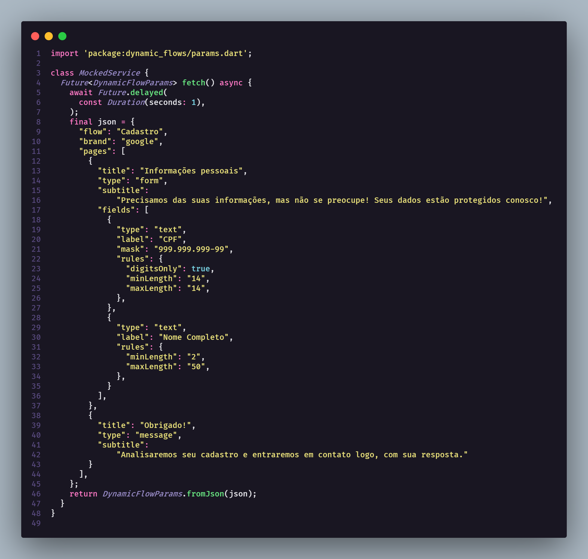
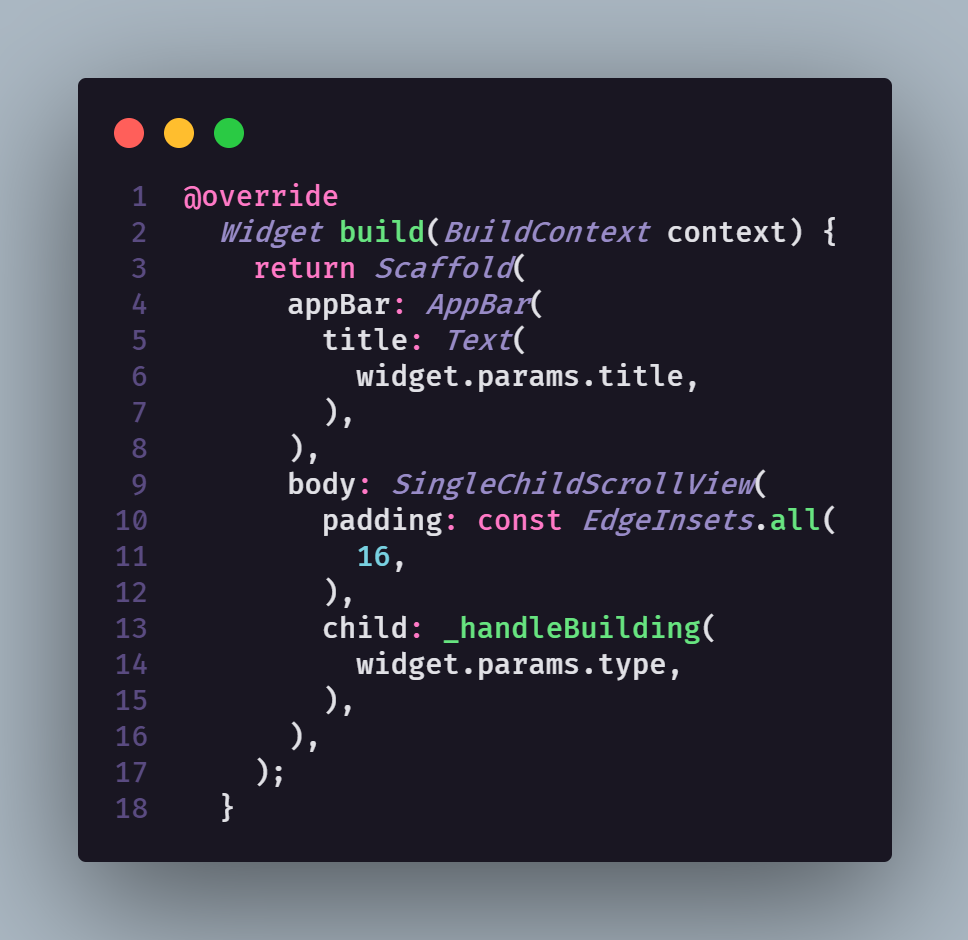
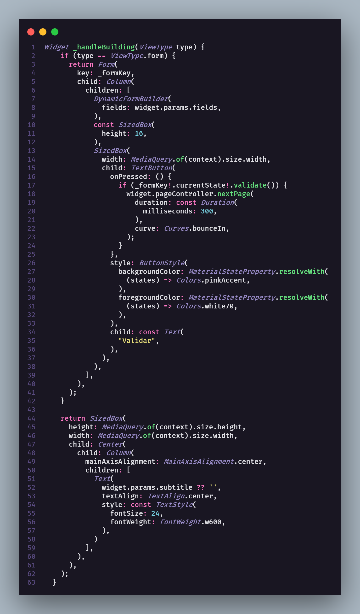
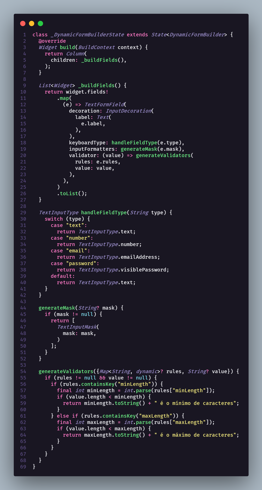
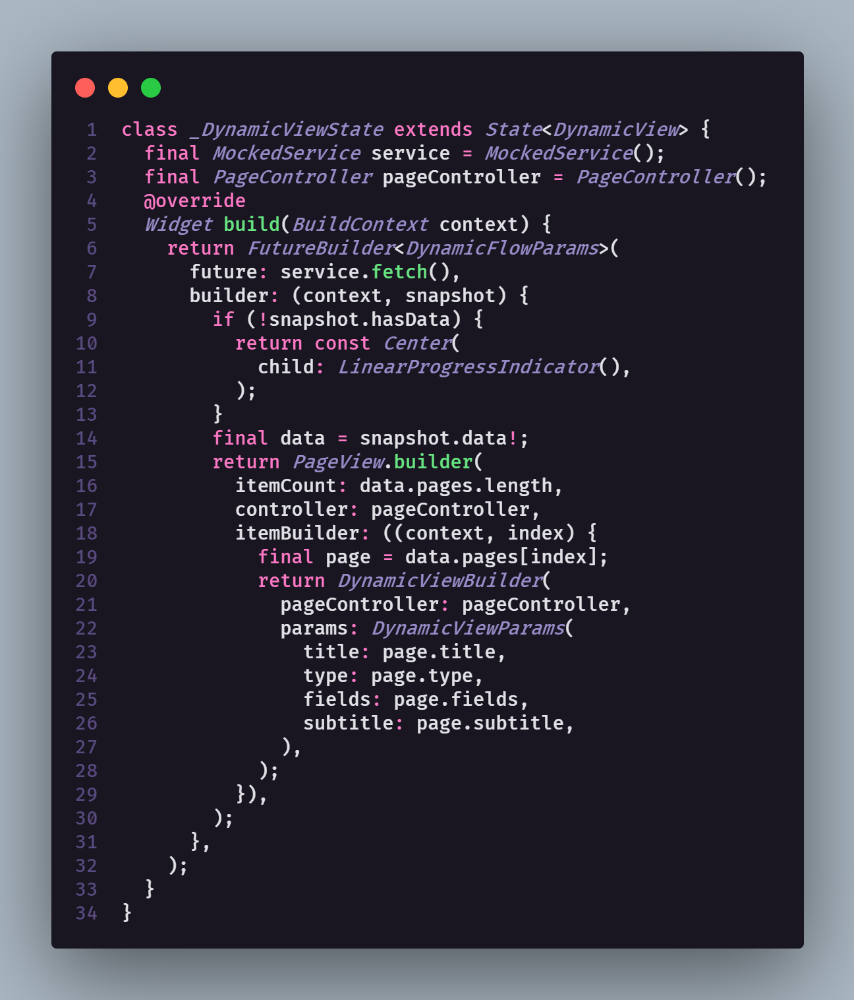

# dynamic_flows

This project is an example of Backend For Frontend pratices applying.
Although I also show how to make json-oriented widgets, being useful for many scenarios.

## BFF Oriented App Advantages

If you don't know what is a Backend for Frontend, the answer is quite simple. It is a middle layer between frontend (that can be mobile, web, desktop, IoC, etc.) and backend itself. This layer will be responsible for some points that are not exactly backend's responsabilities nor frontend's. It can also be used to make easy changing apps, once some elements will be dependending from http requests' results, which can algo be a negative point depending your usecase.
So, you should be asking yourself right now "Okay, mr obvious, but what exactly this means?", better than just explaining you, will be showing you. So, let's go!

## Json-oriented Generated Widgets

There is no magic about dynamic widgets or flows in Flutter, in a nutshell, you expect a json template, which will contain data that will be used by a widget to build itself according to this same data.

As you can see here, I just mocked a fake service to return a json template, which will be used to make my app flow.
Once I get this json, I parse it to an dart object, this will make my life easier to handle properties and even to validate data itself.

I built a widget named <strong>DynamicViewBuilder</strong> which will be responsible for page data handling, It means it will basically set the expected view I want, It can be a form or a message in this context, but according to your app, you will have differente templates. 

The <strong>_handleBuilding</strong> method will return the expected widget, as You can see, it will only be checking some props and building it.
It is valid to say that is only an <strong>example</strong>, not actually worried about good coding pratices, since i just want to show something specific.

Well, now we have our page being dynamicly builded, but the form fields, which will be varying when we talk about it validations, labels and even styling. It should be painful, right? Indeed, that will be a little bit more hard-working than just select a widget type based on a type, however, still not a seven-headed dragon. Let's see.

<strong>DynamicFormBuilder</strong>, as the name explains itself, will be the guy which will build our widget, as you can see, in most cases, all you need to do is the old and good "from to" method.
This you depends directly on your context, but in most cases, you can make a Service to each dynamic widget, which will be responsible to "translate" and build the expected widget props and behaviours.

## Finally

I am adding the builder to a pageview, 'cause i want it to treat this flow this way, but you can code it to navigate or whatever. As you can see, it is not a difficult approach and it can be useful in some scenarios, such as variable flows, variable layouts according to user preferences, such as menu items order or even entire white label apps.

Hope you enjoy it!